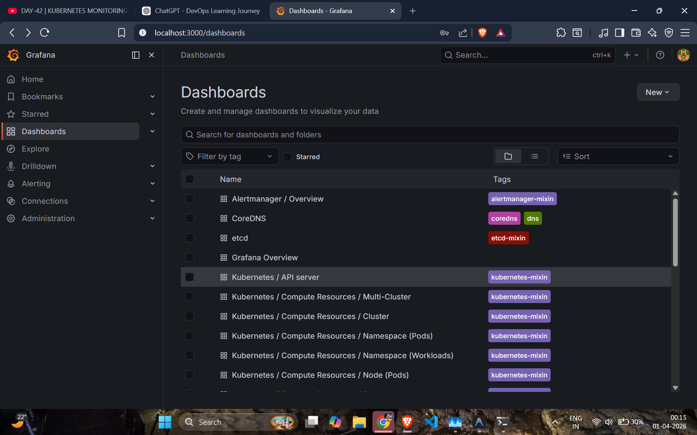
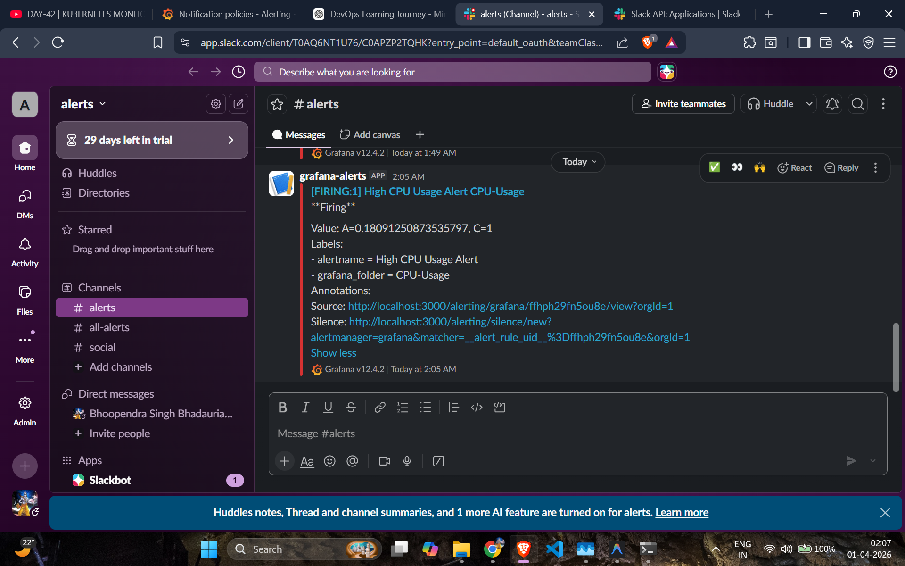

# Kubernetes Monitoring & Alerting System

### using Prometheus, Grafana & Slack


---

## 1. Overview

This project demonstrates a complete **Kubernetes Monitoring and Alerting System** built using industry-standard tools.

The system continuously monitors cluster resources such as **CPU, memory, and pod metrics**, visualizes them using Grafana dashboards, and triggers alerts when defined thresholds are exceeded.

Alerts are automatically sent to a Slack channel in real time using webhooks, enabling fast incident response.

---

## 2. Architecture Diagram

```
Kubernetes Cluster (Minikube)
        │
        ▼
Prometheus (Metrics Collection)
        │
        ▼
Grafana (Visualization + Alerting)
        │
        ▼
Alert Rule Evaluation (PromQL)
        │
        ▼
Notification Policy
        │
        ▼
Slack Webhook (HTTP POST)
        │
        ▼
Slack Channel (#alerts)
```

---

## 3. Tools Used

* **Kubernetes (Minikube)** – Local cluster setup
* **Prometheus** – Metrics collection and storage
* **Grafana** – Visualization and alerting
* **Helm** – Package manager for Kubernetes
* **Slack Webhooks** – Real-time alert notifications
* **Stress Tool** – Load generation for testing alerts

---

## 4. Setup Steps

### Step 1: Start Minikube

```bash
minikube start
```

---

### Step 2: Install Helm

```bash
sudo snap install helm --classic
```

---

### Step 3: Add Prometheus Helm Repo

```bash
helm repo add prometheus-community https://prometheus-community.github.io/helm-charts
helm repo update
```

---

### Step 4: Install kube-prometheus-stack

```bash
helm install monitoring prometheus-community/kube-prometheus-stack
```

---

### Step 5: Verify Installation

```bash
kubectl get pods -A
```

---

### Step 6: Access Grafana

```bash
kubectl port-forward svc/monitoring-grafana 3000:80
```

👉 Open in browser:
http://localhost:3000

---

### Step 7: Get Grafana Admin Password

```bash
kubectl get secret monitoring-grafana -o jsonpath="{.data.admin-password}" | base64 --decode
```

---

### Step 8: Setup Slack Webhook

1. Create Slack channel (#alerts)
2. Create Slack App
3. Enable Incoming Webhooks
4. Generate Webhook URL

---

### Step 9: Configure Slack in Grafana

* Go to: **Alerting → Contact Points**
* Add new contact point:

  * Type: Slack
  * Paste Webhook URL

---

### Step 10: Setup Notification Policy

* Go to: **Alerting → Notification Policies**
* Attach Slack contact point

---

### Step 11: Create Alert Rule

Example condition:

```bash
sum(rate(container_cpu_usage_seconds_total[1m])) > 0.05
```

---

### Step 12: Generate Load (Test Alert)

```bash
kubectl run stress --image=progrium/stress -- stress --cpu 2 --timeout 60
```

---

## 🚨 5. Alert Flow

```
Application Load Increases
        │
        ▼
Prometheus Collects Metrics
        │
        ▼
Grafana Evaluates PromQL Query
        │
        ▼
Condition Becomes TRUE
        │
        ▼
Alert State = FIRING
        │
        ▼
Grafana Sends HTTP Request (Webhook)
        │
        ▼
Slack Receives Request
        │
        ▼
Message Displayed in Channel (#alerts)
```

---

## 📸 6. Screenshots

### 🔹 Grafana Dashboard


### 🔹 Alert Rule (Firing State)



### 🔹 Slack Notification



---

## Key Learnings

* Implemented real-time monitoring in Kubernetes
* Understood Prometheus metrics and scraping
* Built dashboards using Grafana
* Designed alert rules using PromQL
* Integrated Slack for automated alerting
* Simulated real-world incident scenarios

---

## Future Improvements

* Email alert integration
* Deployment on cloud (AWS EKS / GKE)
* Custom dashboards
* Alert severity levels (warning, critical)

---

## Conclusion

This project demonstrates a complete **end-to-end monitoring and alerting pipeline**, similar to real-world DevOps and SRE environments.

It provides a strong foundation in **observability, alerting, and incident response systems**.

---
